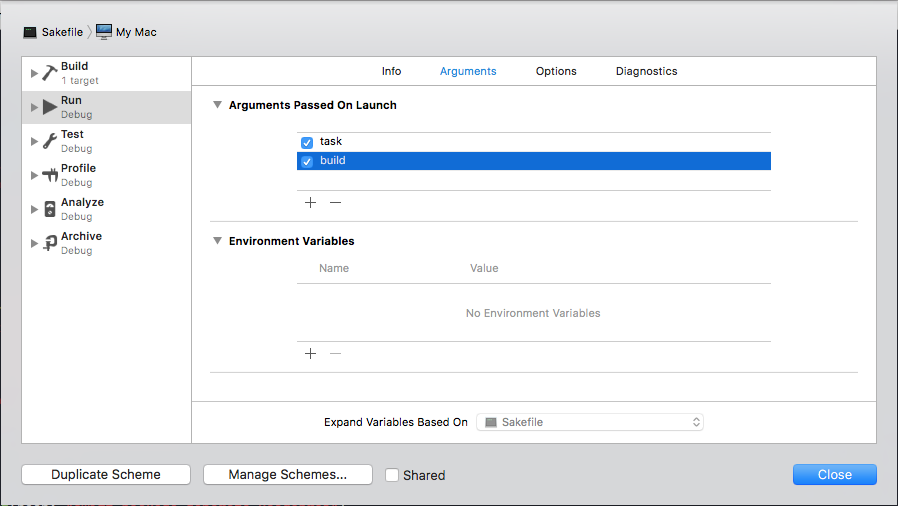

# Sake - Swift Make 

<a href="https://travis-ci.org/xcodeswift/sake">

</a>
<a href="https://swift.org/package-manager">

</a>
<a href="https://twitter.com/xcodeswiftio">
  
</a>
<a href="https://github.com/xcodeswift/sake/releases">
  
</a>
<a href="https://opensource.org/licenses/MIT">
  
</a>
<a href="http://xcodeswift.herokuapp.com/">
  
</a>

Sake is a Swift command line tool that helps you automate tasks in your projects. It's heavily inspired by [Makefile](https://en.wikipedia.org/wiki/Makefile) and [Rake](https://github.com/ruby/rake).

## Path to 1.0.0 🚴
Sake hasn't reached the first major version yet. We are still defining many things around how Sake works and how the API works. These decissions might result into breaking changes in the Sake APIs. Once we reach the version 1.0.0 we'll use [semantic versioning](https://semver.org/) ensuring that only major versions include breaking changes.

We kindly ask you to use Sake on your own responsibility during this early stage and encourage you to participate in discussions that might determine what Sake final version looks like.

## Motivation 💅

Why automating tasks using shell scripting or Ruby when you can do it in Swift, a language you are already familiar with?
Sake aims to provide a command line tool and the foundation to automate your tasks in Swift.

## Installation 🥑

You can easily install sake using [Homebrew](https://brew.sh/):

```
brew tap xcodeswift/sake git@github.com:xcodeswift/sake.git
brew install sake
```

## Setup ⚒

1. Git clone the project `git clone https://github.com/xcodeswift/sake.git`.
2. Build `swift build`.

## Sakefile

Sakefile is the file that defines your project tasks:

```swift
// #!/usr/bin/env sake --path
import SakefileDescription

Sake(tasks: [
  Task("build", description: "Builds the project") {
    // Here is where you define your build task
  }],
  hooks: [
    .beforeAll({ print("Before all the tasks" )})
  ]
)
```

## Usage 👩🏻‍💻

#### Creating a Sakefile.swift 📝
You can create an empty `Sakefile.swift` running the following command:

```bash
sake init
```

#### Working on the Sakefile.swift 💼
You can edit the `Sakefile.swift` using any text editor. Nonetheless, we recommend you to use Xcode since you'll get syntax highlighting and code autocompletion for free. Sake provides a command to generate the Xcode project where you can edit the `Sakefile.swift`. You can generate the command by running:

```bash
sake generate-xcodeproj
```

> :warning: Note: You shouldn't modify the content in the main.swift file. Your `Sakefile.swift` should contain a top level variable named sake in order for Xcode to be able to run Sake.

To define the arguments to be passed to Sake you can edit the Scheme as shown in the screenshot below and add your arguments there:

 

#### Tasks ✅

##### Run a task

```bash
sake task name_of_the_task
```

##### List all the tasks

```bash
sake tasks
```

> Shebang: You can run your `Sakefile.swift` directly calling `./Sakefile.swift`

## Utils ☕️

Sake includes some utils in `SakefileDescription` that might be useful for your tasks:

```swift
// Shell (examples)
try Utils.shell.runAndPrint(bash: "swift build")
try Utils.shell.run(bash: "swift build")

// Git (examples)
let branch = try Utils.git.branch()
let anyChanges = try Utils.git.anyChanges()
try Utils.git.commit(message: "my commit message")
try Utils.git.tag("3.0.0)
let tags = try Utils.git.tags()

// HTTP (examples)
let response = try Utils.http.execute(request: request, parse: { try GitHubRelease.init(data: $0) })
```

## Sakefile Guidelines 🎨

The Swift code written in the `Sakefile.swift` file should meet the following guidelines:

- It shouldn't fail the execution either using `fatalError` or force unwrapping nil values. Failing the execution causes the tool to print the stack trace in the console. Instead throw errors that are handled by `Sake` and nicely printed into the console.
- Code should be synchronous and tasks should be completed by the time the closure execution ends.

## Alternatives 🤩

Sake is not the only tool that helps with automation. There are other tools that are also worth considering:

| Tool | Link | Language |
| -------|-------------| -----|
| Fastlane | [fastlane](https://github.com/fastlane) | Ruby |
| Beak | [yonaskolb/beak](https://github.com/beak) | Swift |
| Rake | [ruby/rake](https://github.com/ruby/rake) | Ruby |

> If you know any other tool that you think fits into this section feel free to open a PR proposing it.

## License

```
MIT License

Copyright (c) 2017 xcode.swift

Permission is hereby granted, free of charge, to any person obtaining a copy
of this software and associated documentation files (the "Software"), to deal
in the Software without restriction, including without limitation the rights
to use, copy, modify, merge, publish, distribute, sublicense, and/or sell
copies of the Software, and to permit persons to whom the Software is
furnished to do so, subject to the following conditions:

The above copyright notice and this permission notice shall be included in all
copies or substantial portions of the Software.

THE SOFTWARE IS PROVIDED "AS IS", WITHOUT WARRANTY OF ANY KIND, EXPRESS OR
IMPLIED, INCLUDING BUT NOT LIMITED TO THE WARRANTIES OF MERCHANTABILITY,
FITNESS FOR A PARTICULAR PURPOSE AND NONINFRINGEMENT. IN NO EVENT SHALL THE
AUTHORS OR COPYRIGHT HOLDERS BE LIABLE FOR ANY CLAIM, DAMAGES OR OTHER
LIABILITY, WHETHER IN AN ACTION OF CONTRACT, TORT OR OTHERWISE, ARISING FROM,
OUT OF OR IN CONNECTION WITH THE SOFTWARE OR THE USE OR OTHER DEALINGS IN THE
SOFTWARE.
```
